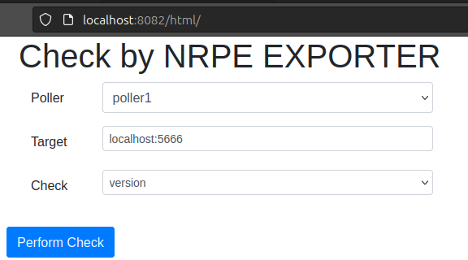

# check_by_nrpe_exporter

- webserver that wait for clients request sent in JSON format
- check request content for a command that is understood
- translate it to expected nrpe_exporter format and send it to corresponding nrpe_exporter (poller)
- translate openmetrics response from poller into a JSON format.

# pre-requirements
* nrpe_exporter v 0.3.0:
    * build with result_message enabled
    * transport ssl (openssl 1.1 or 3.1 enabled)
    
* nrpe agent compiled with allow arguments

# configuration
config is defined in conf/check_by_nrpe_exporter.yml
it defines:
 * known pollers list
 * allowed commands

 ## pollers list

 format:
 ```ymal
 pollers:
    name:
        scheme: http(default)|https         # may be omitted
        host: fully_qualified_domain_name   # mandatory
        port: 9275                          # may be omitted
        baseUrl: ""             # may be omitted
        proxy:                  # may be omitted
        VeriySSL: true          # may be omitted
        scrape_timeout: 10      # may be omitted

    example:
        host: my_nrpe_exporter.domain.name

 ```

 ## commands
 list of knowns command, that user can address and check every targets using poller.

format:

```yaml
checks:
    command_name:
        command: real_nrpe_command_to_play
        command_line: command_template_argument_line
        params:
            - name: param_name
              display: label display for this param (default name)
              help: tootips to display for this param
              mandatory: true|false
              type: text(default)|number|password|email|tel|url 
              default: "value" # a default value for parameter
              encode: "" or "base64"

  filesystem:
    command: check_disk
    command_line: "
      -X binfmt_misc -X devpts -X devtmpfs -X none -X proc -X procfs -X rpc_pipefs 
      -X sysfs -X tmpfs -X overlay -X debugfs -X tracefs -X autofs -X cgroup 
      --errors-only {{ .options }} -t {{ .timeout }} -w {{ .perc_threshold_warn }} -c {{ .perc_threshold_crit }} --all --local -i /.snapshot/"
    params:
      - name: perc_threshold_warn
        display: warn threshold
        help: warning free space thresdhold; if free bytes are less or egal to threshold, WARNING state is raised
        default: 5
        mandatory: true
        type: number
      - name: perc_threshold_crit
        display: critical threshold
        help: critical free space threshold; if free bytes are less or egal to threshold, CRITICAL state is raised
        default: 3
        mandatory: true
        type: number
      - name: timeout
        default: 5
        type: number
        mandatory: true
        help: timeout in second for the remote command to execute
      - name: options
        default: ""


```

# web server

## REST API

### check

* GET /api/check

  return the list of all available checks.

  ```json
  {
    "checks":[
      "filesystem",
      "filesystemre",
      "...",
    ],
    "message":"ok",
    "status":1
  }
  ```


* GET /api/check/check_name

  return details of command and paramater for a check.

  e.g.: GET /api/check/filesystem
  ```json
  {
    "check":{
      "filesystem":{
        "command": "check_disk",
        "command_line":" -X binfmt_misc -X devpts -X devtmpfs -X none -X proc -X procfs -X rpc_pipefs -X sysfs -X tmpfs -X overlay -X debugfs -X tracefs -X autofs -X cgroup --errors-only {{ .options }} -t {{ .timeout }} -w {{ .perc_threshold_warn }} -c {{ .perc_threshold_crit }} --all --local -i /.snapshot/",
        "params": [ {
          "name": "perc_threshold_warn",
          "display": "warn threshold",
          "help": "warning free space thresdhold; if free bytes are less or egal to threshold, WARNING state is raised",
          "mandatory": true,
          "default":"5",
          "type":"number"
          }, { 
            "name": "perc_threshold_crit",
            "display":"critical threshold",
            "help":"critical free space threshold; if free bytes are less or egal to threshold, CRITICAL state is raised",
            "mandatory": true,
            "default": "3",
            "type":"number"
          },{
            "name": "timeout",
            "help": "timeout in second for the remote command to execute",
            "mandatory": true,
            "default": "5",
            "type": "number"
          },{
            "name":"options"
          }
        ]
      }
    },
    "message": "ok",
    "status":1
  }
  ```
### poller

* GET /api/poller

  return the list of all available pollers.

  ```json
  {
    "message": "ok",
    "status": 1,
    "pollers":[
      "poller1","poller2","poller3"
    ]
  }
  ```

* GET /api/poller/poller_name

  return the detail for the poller poller_name.

  e.g.: GET /api/poller/poller1

  ```json
  {
    "message": "ok",
    "poller": {
      "poller1": {
        "scheme": "http",
        "host": "poller1.myhost.domain",
        "port": "9275",
        "auth_mode":{"mode":"basic"},
        "proxy": "http://poller1.myhost.domain:9101",
        "verifySSL":true,
        "scrape_timeout":"10s"
      }
    },
    "status":1}
  ```


### trycheck

command check are sent to "/api/trycheck" with POST method
format:

POST /api/trycheck
with body
```json
{
    "poller": "poller_name",
    "type": "command_name",
    "target": "host:port",
    "params": {
        "name1": "value1", 
        "name_2": "value2"
        [,...]
    }
}
```

e.g.: check for process
POST /api/trycheck
```json
{"poller": "poller_name", "target": "hostname:5666", "type": "process", "params": {"process": ".*sshd.*"}}
```

## Web interface

there is only one page served by url /html/inde.html.

It is a bootstrap, jquery html, css, javscript page that allow user to check commands (check) over a poller.

It queries REST API part to retrieve pollers, checks and to perform query to nrpe_exporter on the sselected poller for the target and displays the result of the check.


